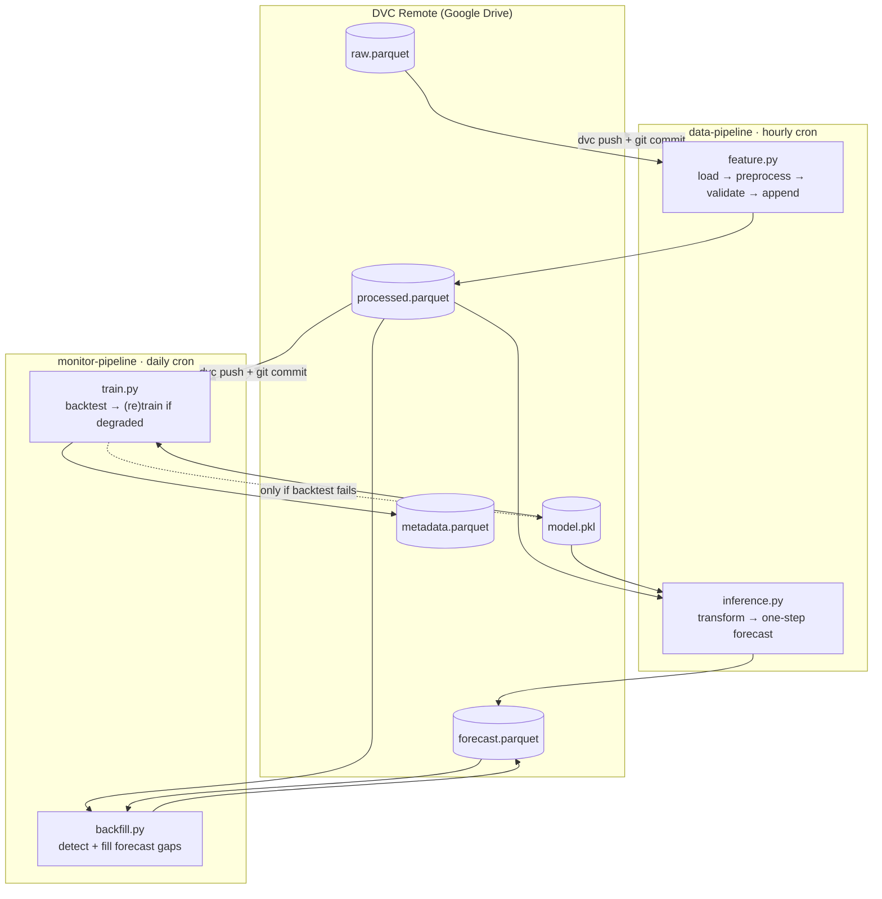

# Energy Demand Forecasting Service

An end-to-end, fully automated machine learning service that forecasts **hourly energy demand (MW)** for a set of utility companies. The service ingests data on an hourly cadence, engineers time-series features, produces one-step-ahead forecasts, and continuously monitors itself — retraining only when performance degrades below a defined threshold.

Everything runs on GitHub Actions. Data and model artifacts are versioned with DVC and stored on Google Drive. No servers, no orchestrator, no cloud bill.


---

## Table of Contents

- [Overview](#overview)
- [Architecture](#architecture)
- [How It Works](#how-it-works)
  - [Feature Pipeline](#1-feature-pipeline)
  - [Inference Pipeline](#2-inference-pipeline)
  - [Training / Monitoring Pipeline](#3-training--monitoring-pipeline)
  - [Backfill Pipeline](#4-backfill-pipeline)
- [Feature Engineering](#feature-engineering)
- [Modeling Approach](#modeling-approach)
- [Model Monitoring & Retraining Policy](#model-monitoring--retraining-policy)
- [Project Structure](#project-structure)
- [Getting Started](#getting-started)
- [Usage](#usage)
- [Configuration Reference](#configuration-reference)
- [Artifacts](#artifacts)
- [CI/CD](#cicd)
- [License](#license)

---

## Overview

Grid operators and energy retailers need short-horizon demand forecasts to balance load, schedule generation, and price contracts. This project implements that capability as a **continuously running service** rather than a notebook experiment.

**What it does**

| | |
|---|---|
| **Target** | `energy_demand_mw` — hourly energy demand, per `company_id` |
| **Horizon** | One hour ahead (recursive multi-step supported for backtesting) |
| **Cadence** | Feature + inference every hour; monitor + backfill daily |
| **Models** | LightGBM and XGBoost regressors, selected by competition |
| **Validation** | Walk-forward (expanding-window) cross-validation, 5 folds |
| **Tuning** | Bayesian optimization via Hyperopt (TPE) |
| **Retraining** | Conditional — triggered only by a failed backtest |
| **Storage** | Parquet artifacts, DVC-tracked, Google Drive remote |
| **Orchestration** | GitHub Actions (cron) |

**Stack:** Python 3.11 · Polars · LightGBM · XGBoost · Hyperopt · scikit-learn · statsmodels · OmegaConf · Loguru · DVC · uv · GitHub Actions

---

## Architecture



Each workflow run is stateless: it pulls artifacts with `dvc pull`, executes, pushes changed artifacts with `dvc push`, commits the updated `artifacts.dvc` pointer, and wipes the workspace.

---

## How It Works

### 1. Feature Pipeline

`src/pipelines/feature.py` — runs hourly.

1. Reads the existing `processed.parquet` to determine the latest timestamp per company.
2. Loads `raw.parquet` and **pre-processes** it (`src/data.py::preprocess_data`):
   - Each company's series is shifted forward in time so that its earliest observation aligns to `offset_year`. This replays a fixed historical dataset as if it were arriving live.
   - Filters to the trailing `lookback` window (default 14 days) ending at the current UTC hour.
   - Upsamples to a strict 1-hour grid per company and forward-fills gaps.
   - De-duplicates on `(company_id, timestamp_utc)` and sorts.
3. **Validates** (`validate_data`): schema conformance against the existing parquet, zero duplicates, zero nulls. Failures raise and fail the workflow.
4. Filters the batch to strictly-new timestamps and appends to `processed.parquet`.

### 2. Inference Pipeline

`src/pipelines/inference.py` — runs hourly, immediately after the feature pipeline.

1. Loads the trailing `lookback` window of processed data.
2. Transforms it into ML-ready features (see [Feature Engineering](#feature-engineering)).
3. Calls `get_one_step_forecast` to predict demand for the **next hour** for every company.
4. Upserts the result into `forecast.parquet`, keyed on `(company_id, timestamp_utc)`.

If `model.pkl` does not exist, `load_model()` bootstraps the entire model-building process on demand (build → tune → save → write metadata), so a cold start is self-healing.

### 3. Training / Monitoring Pipeline

`src/pipelines/train.py` — runs daily at midnight UTC.

This pipeline **does not retrain unconditionally**. It first backtests the incumbent model (`src/monitor.py::backtest_model`) and retrains only on failure. See [Model Monitoring & Retraining Policy](#model-monitoring--retraining-policy).

### 4. Backfill Pipeline

`src/pipelines/backfill.py` — runs daily, after training.

Compares `processed.parquet` against `forecast.parquet` within each company's forecast coverage window and identifies hours that have an observation but no forecast — typically caused by a failed or skipped hourly run. For every missing hour it reconstructs the feature window as it would have looked at that moment (`hour − 1` back through `hour − 1 − lookback`), regenerates the one-step forecast, and coalesces it into the forecast table. This keeps the forecast history dense and honest, which matters because monitoring metrics are computed off it.

---

## Feature Engineering

`src/data.py::transform_data` builds three families of features per company, then joins the label back on.

**Lag features** — `lag_1` … `lag_32`
: The previous 32 hourly observations of the target. The default of 32 was chosen by inspecting the partial autocorrelation function (`src/utils.py::get_max_lag` finds the largest lag with |PACF| > 0.1, rounded to a multiple of `step`).

**Window features** — `avg_4_lags`, `avg_8_lags`, … `avg_32_lags`
: Rolling means over the trailing *k* lags for *k* ∈ {4, 8, …, 32}. These smooth out hour-to-hour noise and give the model multi-scale trend context cheaply.

**Datetime features** — cyclical + categorical
: `sine_hour` / `cosine_hour` encode hour-of-day on the unit circle so that hour 23 and hour 0 are adjacent. Four boolean flags (`is_morning`, `is_afternoon`, `is_evening`, `is_night`) partition the day into demand regimes. Timestamps are converted from UTC to Eastern before extracting the hour, so the encoding reflects local human behavior rather than UTC.

The resulting frame is `[company_id, timestamp_utc, 2 cyclical, 4 boolean, 8 window, 32 lag, target]`. `company_id` and `timestamp_utc` are identifiers, not features — a **single global model** is trained across all companies, learning demand *shape* from lag structure rather than company identity.

Two additional utilities are available for offline analysis but are not wired into the pipelines: `select_relevant_features` (mutual-information filtering) and `plot_time_series_splits` (visualizing the CV scheme).

---

## Modeling Approach

**Candidate selection.** `build_model` trains both an `LGBMRegressor` and an `XGBRegressor` with the base parameters in `params.yaml` and keeps whichever produces the lower mean validation RMSE. Both use early stopping (50 rounds) against the fold's validation set.

**Walk-forward validation.** `get_time_series_splits` produces `k` expanding-window folds over the unique sorted timestamps. Fold boundaries advance through time; each fold's train set is strictly earlier than its validation set. No shuffling, no leakage.

```
Fold 1: ├──── train ────┤── val ──┤
Fold 2: ├────── train ──────┤── val ──┤
Fold 3: ├──────── train ────────┤── val ──┤
...
```

**Hyperparameter tuning.** `tune_model` runs Hyperopt's TPE for 20 evaluations over a model-specific search space, minimizing mean walk-forward validation RMSE. The tuned parameters are merged over the base parameters and the model is retrained from scratch.

| LightGBM | XGBoost |
|---|---|
| `n_estimators` ∈ [100, 500) | `n_estimators` ∈ [100, 500) |
| `max_depth` ∈ [3, 10) | `max_depth` ∈ [3, 10) |
| `learning_rate` ∈ [0.01, 0.3] | `learning_rate` ∈ [0.01, 0.3] |
| `num_leaves` ∈ [8, 256) | `min_child_weight` ∈ [0, 10) |
| `min_data_in_leaf` ∈ [5, 300) | `reg_alpha` ∈ [0, 10] |

**Forecasting.** `get_one_step_forecast` synthesizes the next hour's feature row without needing new data: lags shift by one (the current target becomes `lag_1`), window features are recomputed from the shifted lags, and datetime features are derived from `t + 1h`. Predictions are floored at zero. `get_multi_step_forecast` applies this recursively, feeding each forecast back in as the next step's target.

**Lineage.** Every trained model writes a row to `metadata.parquet`: model class, source data path, data start/end, UTC training timestamp, JSON-serialized hyperparameters, and validation RMSE. The table is append-only and sorted newest-first.

---

## Model Monitoring & Retraining Policy

Retraining on a fixed schedule wastes compute and risks replacing a good model with a worse one. This project retrains **only on evidence of degradation**.

`backtest_model` replays the last 12 hours. For each evaluation size *n* ∈ {1, …, 12}:

1. Split the data so the final *n* hours are held out.
2. Generate an *n*-step recursive forecast from the model.
3. Generate a **naive forecast** — the last observed value, carried forward.
4. Score both against actuals using R².

The incumbent model is kept only if **both** conditions hold:

- **Condition 1** — mean model R² > max(`threshold`, mean naive R²). The model must clear an absolute quality bar *and* beat the trivial baseline.
- **Condition 2** — every single one of the 12 horizons individually exceeds `threshold`. No horizon is allowed to fail.

If either fails, the full build-and-tune cycle runs and the new model replaces `model.pkl`. Benchmarking against a persistence baseline is the part most projects skip — a forecaster that can't beat "same as last hour" isn't earning its keep, and this pipeline will notice.

---

## Project Structure

```
.
├── src/
│   ├── config.py          # Paths class + OmegaConf params loader
│   ├── data.py            # load / preprocess / validate / transform / split
│   ├── forecast.py        # one-step and recursive multi-step forecasting
│   ├── model.py           # train / build / tune / persist / metadata
│   ├── monitor.py         # backtesting + forecast backfilling
│   ├── logger.py          # Loguru config, writes to ./logs/<timestamp>.log
│   ├── utils.py           # PACF lag selection, cyclical encoding, CV splits, metrics
│   └── pipelines/
│       ├── feature.py     # hourly  · ingest → validate → append
│       ├── inference.py   # hourly  · transform → forecast → upsert
│       ├── train.py       # daily   · backtest → conditional retrain
│       └── backfill.py    # daily   · fill forecast gaps
├── .github/workflows/
│   ├── data_pipeline.yaml     # cron: 0 * * * *
│   └── monitor_pipeline.yaml  # cron: 0 0 * * *
├── artifacts.dvc          # DVC pointer to the artifacts/ directory
├── params.yaml            # all tunable configuration
├── pyproject.toml         # uv-managed dependencies
├── Makefile               # install / check / clean / pipelines / artifact sync
└── LICENSE
```

Every module reads its own configuration block from `params.yaml` by filename (`load_params(Path(__file__).stem)`), so `src/data.py` gets the `data:` block, `src/model.py` gets `model:`, and so on. Adding a module means adding a block — no wiring.

---

## Getting Started

### Prerequisites

- Python 3.11.12
- [uv](https://docs.astral.sh/uv/)
- A Google Drive folder and a **service account** with access to it (for the DVC remote)

### Installation

```bash
git clone https://github.com/ncheymbamalu/energy-demand-forecasting.git
cd energy-demand-forecasting

make install          # uv sync
```

### Configure the DVC remote

The remote is declared in `.dvc/config`. Point it at your own Drive folder and supply service-account credentials locally:

```bash
dvc remote modify gdrive url gdrive://<YOUR_FOLDER_ID>
dvc remote modify gdrive --local \
    gdrive_service_account_json_file_path credentials.json

dvc pull              # fetch artifacts/
```

> `credentials.json` is a secret. Keep it out of version control.

### Configure GitHub Actions

Add one repository secret:

| Secret | Value |
|---|---|
| `GDRIVE_SERVICE_ACCOUNT_CREDENTIALS` | Full JSON body of the service-account key |

Both workflows write back to the repository, so ensure **Settings → Actions → Workflow permissions** allows read *and* write.

---

## Usage

```bash
make install            # sync the virtual environment
make check              # isort + ruff over src/
make clean              # remove __pycache__ and .ruff_cache

make data_pipeline      # dvc pull → feature.py → inference.py
make monitor_pipeline   # dvc pull → train.py → backfill.py

make update_artifacts   # dvc add → git commit → dvc push → git push
```

Individual stages:

```bash
uv run python -Wignore src/pipelines/feature.py
uv run python -Wignore src/pipelines/inference.py
uv run python -Wignore src/pipelines/train.py
uv run python -Wignore src/pipelines/backfill.py
```

Programmatic use:

```python
from src.data import load_preprocessed_data, transform_data
from src.forecast import get_multi_step_forecast

data = load_preprocessed_data().pipe(transform_data)
forecasts = get_multi_step_forecast(data, horizon=24)
print(forecasts.select("company_id", "timestamp_utc", "forecast"))
```

Logs stream to stdout with color and are mirrored to `./logs/<YYYY_MM_DD_HH_MM_SS>.log`.

---

## Configuration Reference

All behavior is controlled by `params.yaml`.

### `data`

| Key | Default | Description |
|---|---|---|
| `columns` | `[company_id, timestamp_utc, energy_demand_mw]` | Canonical column set |
| `target_column` | `energy_demand_mw` | Label |
| `temporal_column` | `timestamp_utc` | Time index |
| `lookback` | `14` | Days of history loaded for feature generation |
| `offset_year` | `2025` | Year the earliest raw observation is shifted to |
| `max_lag` | `32` | Number of lag features |
| `step` | `4` | Stride for window (average-lag) features |

### `model`

| Key | Default | Description |
|---|---|---|
| `k` | `5` | Walk-forward validation folds |
| `lightgbm.base_params` | RMSE objective, 50-round early stopping | Fixed LightGBM settings |
| `lightgbm.hyperparams` | 5 names | Parameters recorded in model metadata |
| `xgboost.base_params` | squared-error objective, 50-round early stopping | Fixed XGBoost settings |
| `xgboost.hyperparams` | 5 names | Parameters recorded in model metadata |

### `monitor`

| Key | Default | Description |
|---|---|---|
| `threshold` | `0.8` | Minimum acceptable backtest R², per horizon and on average |

---

## Artifacts

DVC-tracked under `artifacts/` (5 files, ~7 MB):

| Path | Contents |
|---|---|
| `artifacts/data/raw.parquet` | Source historical demand series |
| `artifacts/data/processed.parquet` | Cleaned, gap-filled, hourly-aligned series (append-only) |
| `artifacts/data/forecast.parquet` | One-step forecasts keyed on `(company_id, timestamp_utc)` |
| `artifacts/model/model.pkl` | Current production model (pickled regressor) |
| `artifacts/model/metadata.parquet` | Append-only training lineage |

Retrieve any historical state by checking out the corresponding commit and running `dvc pull` — `artifacts.dvc` pins the exact content hash.

---

## CI/CD

| Workflow | Schedule | Steps |
|---|---|---|
| `data-pipeline` | `0 * * * *` (hourly) | checkout → uv → DVC → `make data_pipeline` → `dvc status` → conditional `make update_artifacts` → clean |
| `monitor-pipeline` | `0 0 * * *` (daily, midnight UTC) | checkout → uv → DVC → `make monitor_pipeline` → `dvc status` → conditional `make update_artifacts` → clean |

Both support `workflow_dispatch` for manual runs. The `dvc status --quiet` gate means commits are only made when artifacts actually changed — no empty-commit churn.

---

## License

MIT © 2025 [ncheymbamalu](https://github.com/ncheymbamalu). See [LICENSE](LICENSE).